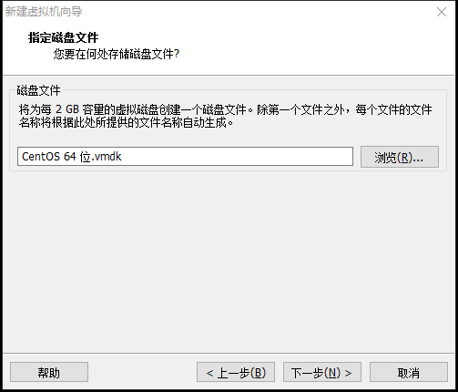
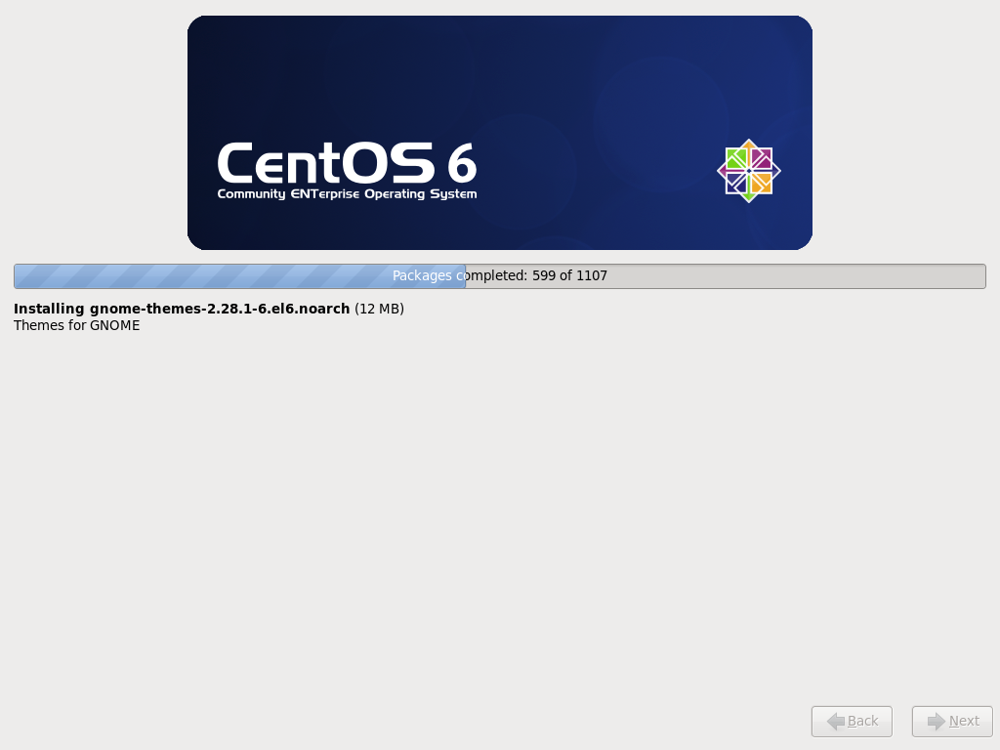
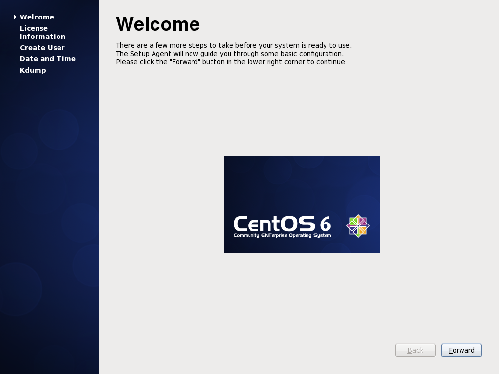

## 虚拟机 CentOS 安装

平时使用的电脑还是Windows，想学习下Linux怎么办，虚拟机是个不错的选择。VMvare可以在一台电脑上同时运行多个LINUX系统，虽然性能和直接安装在硬盘上差很多， 但用来学习和测试还是没问题的。

**准备工作**
虚拟机：VMvare那个版本都行，我使用的12
Linux系统iso：CentOS的那个版本都行，我使用的是6.2

大家看自行选择自己熟悉的或最新的版本。

**安装步骤**

1. 安装VMvare，一路下一步就可以了。
2. 配置虚拟机

VM安装好后，点击新建虚拟机，如图选择自定义安装，点击下一步

如图选择硬件兼容性最大的就可以，点击下一步

如图选择稍后安装操作系统，点击下一步

如图选择所需安装的操作系统和版本，点击下一步

如图修改自己喜欢虚拟机名称和安装位置

如图处理器默认即可，点击下一步

如图内存配置，默认是1g，但我的内存太小，选择了768m，点击下一步

如图，网络类型选择，选择nat，点击下一步

如图I/O选择，默认，点击下一步

如图，磁盘类型，默认，点击下一步

如图磁盘选择，选择新的磁盘，点击下一步

如图，磁盘容量配置，默认即可，点击下一步

如图文件名称，默认即可，点击下一步

如图点击自定义硬件，点击CD/DVD项，连接选择ISO镜像文件，点击关闭，完成。

开启虚拟机就可以安装linux系统了。

**进入欢迎界面**

选择第一项即可进行安装（**直接回车**），各项具体含义：

1. 安装或升级现有系统
2. 用基本的显卡驱动安装系统
3. 进入系统修复模式
4. 硬盘启动

是否对安装镜像进行测试 （**直接就过即可**）

开始设置CentOS 6.2 （**直接Next**）

设置安装过程显示的语言、键盘类型（**这里我选择英语，当然也可以选择中文。键盘类型保持默认即可**）

选择存储设备类型（**默认选第一项：基本存储设备**）

格式化硬盘（选 Yes,discart any data）

设置计算机名（**随便起个名字就行**，如果懒得起，默认吧）

选择时区(**选亚洲/上海**就行了)

设置root用户密码

选择安装（分区）方式（手动设置挂载分区，选Create Custom Layout）

挂载分区 （点Create创建一个分区，默认选择Stantard Partition（标准分区），选择挂载点、分区大小即可创建分区）

下面是我的分区方式（不同的用途可以选择不同的分区，最后不要忘记swap分区哦），点Next，选择Format（格式化），再选Write Change to disk（把分区表写入硬盘）

安装 装载引导程序（默认即可）

选择安装的软件（默认是最小安装，如果需要安装桌面，就选第一项Desktop），点Next就开始安装系统

安装完成，点Reboot重新启动

第一次启动CentOS需要对CentOS进行一些常规设置直接点Forward就行了

创建一个普通用户，Linux并不推荐用Root用户对系统就行操作，Root权限太高，误操作可能会导致系统崩溃。所以建议使用普通用户，如果需要root用户权限时再进行切换

设置系统时间

设置Kdump，这里弹出了警告，不用管。（其实我暂时用不到Kdump，所以不用设置，直接Finish）。

接着就到了登录页面，输入用户名、密码，进入CentOS桌面，安装完成。

[pharen](https://link.zhihu.com/?target=http%3A//www.cnblogs.com/pharen/archive/2012/02/06/2339322.html) 安装很详细，直接拿过来用一下。