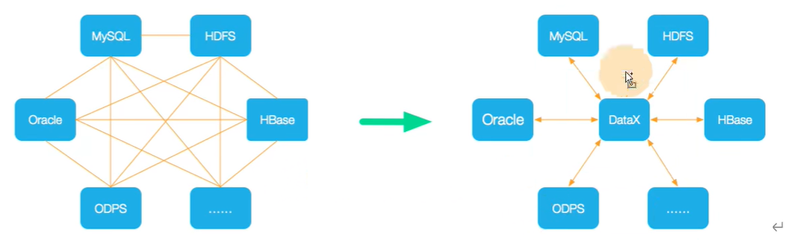
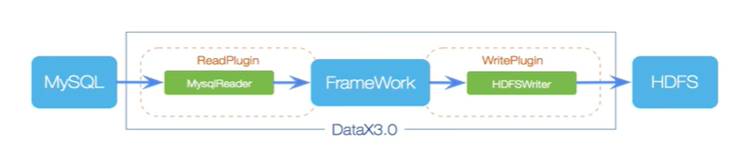
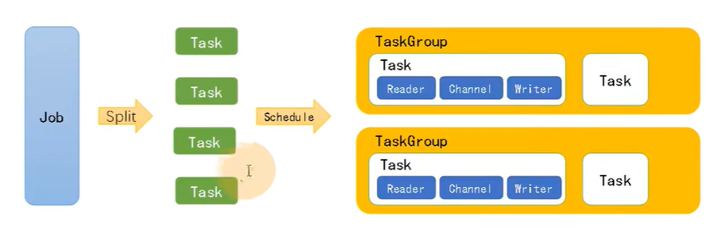
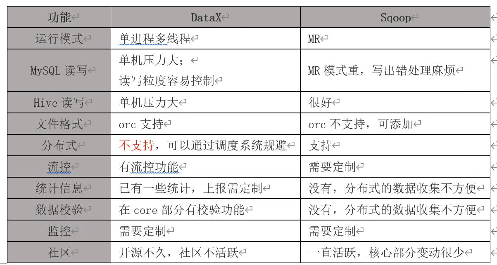
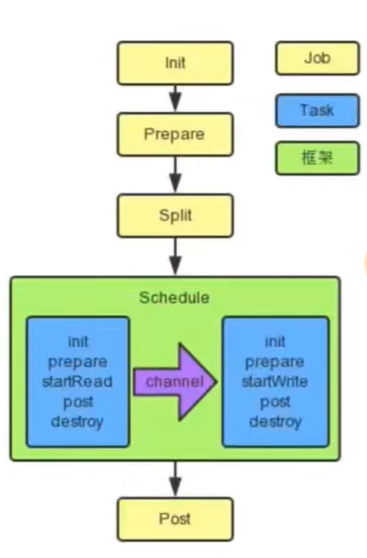

下载地址: 
https://datax-opensource.oss-cn-hangzhou.aliyuncs.com/datax.tar.gz
https://datax-opensource.oss-cn-hangzhou.aliyuncs.com/202308/datax.tar.gz
源码文档地址: https://github.com/alibaba/DataX

1. 什么是DataX
   DataX是阿里云DataWorks数据集成的开源版本，一个异构数据源高效的离线数据同步工具(平台)。
   已经支持的数据源可查看文档，并支持扩展。
   将复杂的网状的同步链路变成星型链路，作为中间件(插件)连接各种数据源。
   
2. 架构
   

   Reader: 数据采集模块，负责采集数据源的数据，将数据发送给Framework。
   Writer:数据写入模块，负责不断向Framework取数据，并将数据写入到目的端。
   Framework:用于连接reader和writer，作为两者的数据传输通道，并处理缓冲，流控，并发，数据转换等核心技术问题。
   类似flume，Source(Reader), Channle(Framework), Sink(Writer)
3. 运行原理
   
   Job:单个作业的管理节点，负责数据清理、子任务划分、TaskGroup监控管理。
   Task:由Job切分而来，是DataX作业的最小单元，每个Task负责一部分数据的同步工作。
   Schedule:将Task组成TaskGroup，单个TaskGroup的并发数量为5。
   TaskGroup:负责启动Task。
   举例来说，用户提交了一个 Datax作业，并且配置了20个并发，目的是将一个 100张分表的 mysql数据同步到odps 里面。 Datax的调度决策思路是:
   1)DataXJob根据分库分表切分成了100个Task。
   2)根据20个并发，Datax计算共需要分配4个TaskGroup(单个TaskGroup的并发数量为5)。
   3)4个TaskGroup平分切分好的100个Task，每一个TaskGroup需运行25个Task，一次并发5个，需运行5次。
4. 框架选型，与sqoop对比
   
5. 案例
   运行任务
   python bin/datax.py job/job.json

   查看读取mysql，写入hdfs的json格式
   python bin/datax.py -r mysqlreader -w hdfswriter

   按要求填写json文件，运行datax.py文件即可

   扩展数据源(以db2的读为例，写和读一致，修改对应写的两个地方)
   + **jdbcUrl**
     - db2格式 jdbc:db2://ip:端口/数据库
  
     **rdbmsreader如何增加新的数据库支持:**   
     + 进入rdbmsreader对应目录，这里\${DATAX_HOME}为DataX主目录，即: \${DATAX_HOME}/plugin/reader/rdbmsreader
     + 在rdbmsreader插件目录下有plugin.json配置文件，在此文件中注册您具体的数据库驱动，具体放在驱动程序队列中。rdbmsreader插件在任务执行时会动态选择合适的数据库驱动连接数据库。
     ``` 
     {
      "name": "rdbmsreader",
      "class": "com.alibaba.datax.plugin.reader.rdbmsreader.RdbmsReader",
      "description": "useScene: prod. mechanism: Jdbc connection using the database, execute select sql, retrieve data from the ResultSet. warn: The more you know about the database, the less problems you encounter.",
      "developer": "alibaba",
      "drivers": [
         "dm.jdbc.driver.DmDriver",
         "com.ibm.db2.jcc.DB2Driver",
         "com.sybase.jdbc3.jdbc.SybDriver",
         "com.edb.Driver"
      ]
     }
     ```
     + 在rdbmsreader插件目录下有libs子目录，您需要将您具体的数据库驱动放到libs目录下。
     ```
	  $tree
	  .
	  |-- libs
	  |   |-- Dm7JdbcDriver16.jar
	  |   |-- commons-collections-3.0.jar
	  |   |-- commons-io-2.4.jar
	  |   |-- commons-lang3-3.3.2.jar
	  |   |-- commons-math3-3.1.1.jar
	  |   |-- datax-common-0.0.1-SNAPSHOT.jar
	  |   |-- datax-service-face-1.0.23-20160120.024328-1.jar
	  |   |-- db2jcc4.jar
	  |   |-- druid-1.0.15.jar
	  |   |-- edb-jdbc16.jar
	  |   |-- fastjson-1.1.46.sec01.jar
	  |   |-- guava-r05.jar
	  |   |-- hamcrest-core-1.3.jar
	  |   |-- jconn3-1.0.0-SNAPSHOT.jar
	  |   |-- logback-classic-1.0.13.jar
	  |   |-- logback-core-1.0.13.jar
	  |   |-- plugin-rdbms-util-0.0.1-SNAPSHOT.jar
	  |   `-- slf4j-api-1.7.10.jar
	  |-- plugin.json
	  |-- plugin_job_template.json
	  `-- rdbmsreader-0.0.1-SNAPSHOT.jar
	  ``` 
6. 源码分析
   
   + 黄色: Job部分的执行阶段，
     - Init 初始化
     - Prepare 准备
     - Split 切分
     - Post 事后的处理
   + 蓝色: Task部分的执行阶段，
   + 绿色: 框架执行阶段。
     - Schedule 调度
   + getOptionParser
     - -j或-jvm 设置堆内存 
   + ENGINE_COMMAND
     - com.alibaba.datax.core.Engine
       * main
   + Task 切分逻辑
     - 总
       * job.setting.speed.byte 
       * job.setting.speed.record
       * job.setting.speed.channel
     - 每个
       * core.transport.channel.speed.byte
       * core.transport.channel.speed.record
     - 并发数=min(总的record/每个record,总的byte/每个byte),如果没有，按channel的值
     - taskGroup的数量=并发数/单个TaskGroup的并发数量(5)
     - 写和读的channel是1:1
     - 限流

7. 优化
   角度并发和限流
   job.setting.speed.channel channel并发数
   job.setting.speed.byte 全局配置channel的byte限速
   job.setting.speed.record 全局配置channel的record限速
   core.transport.channel.speed.byte 单个channel的byte限速
   core.transport.channel.speed.record 单个channel的record限速
   + 提升每个channel的速度
     - 设置byte，一般设置这个
     - 设置record 
   + 提升DataX Job内Channel并发数，并发数=taskGroup的数量 * 单个TaskGroup的并发数量(5)
     - 配置全局byte限速以及单个channel byte限速
       * channel个数 = 全局byte限速 / 单个channel byte限速
     - 配置全局record限速以及单个channel record限速
       * channel个数 = 全局record限速 / 单个channel record限速
     - 配置channel个数，优先级最低
       * 上面两种未设置才生效
       * 上面两个都设置取小值  
   + 提高JVM堆内存，建议设置4G或8G，两种方式
     - 修改datax.py里DEFAULT_JVM = "-Xms1g -Xmx1g ..."
     - python datax.py --jvm="-Xms8G -Xmx8G" xxx.json