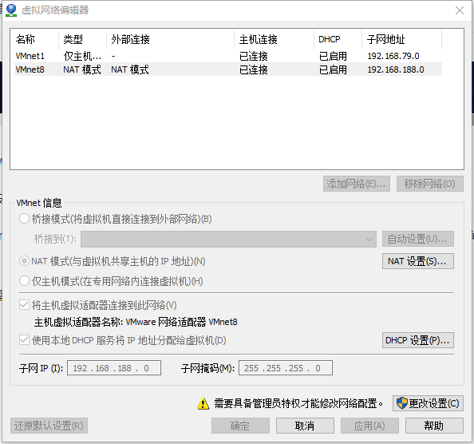

**目前来说，Hadoop的安装部署分为三种模式：**

1. 本地模式
&emsp;&emsp;默认的模式，无需运行任何守护进程（daemon），所有程序都在单个JVM上执行。由于在本机模式下测试和调试MapReduce程序较为方便，因此，这种模式适宜用在开发阶段。使用本地文件系统，而不是分布式文件系统。

2. 伪分布模式
&emsp;&emsp;在一台主机模拟多主机。即Hadoop的守护程序在本地计算机上运行，模拟集群环境，并且是相互独立的Java进程。
&emsp;&emsp;在这种模式下，Hadoop使用的是分布式文件系统，各个作业也是由JobTraker服务，来管理的独立进程。
&emsp;&emsp;在单机模式之上增加了代码调试功能，允许检查内存使用情况，HDFS输入输出，以及其他的守护进程交互。类似于完全分布式模式，因此这种模式常用来开发测试Hadoop程序的执行是否正确。

3. 完全分布模式
&emsp;&emsp;完全分布模式的守护进程运行在由多台主机搭建的集群上，是真正的生产环境。在所有的主机上安装JDK和Hadoop，组成相互连通的网络。

**前两种模式感兴趣的可以自行搭建下，现在为完全分布模式安装做一下前期准备**
1. 请参照[Linux安装教程](/Linux/安装教程.md)，准备3台服务器。
&emsp;&emsp;完全分布模式需要3台服务器，配置出想要的效果。3台服务器按一主二从分配。

2. 配置静态ip
&emsp;&emsp;ip有动态和静态之分，区别在于动态ip每次链接网络时需要自动获取ip地址，每次链接后的ip地址有可能不变，有可能变，是动态变化的；而静态ip可以直接链接网络，无需获取ip地址，每次链接后的ip地址都不变；静态ip应该称为固定ip，刚安装的系统，没配置固定的ip前都是动态ip。
&emsp;&emsp;在一个网络环境中，ip地址对于服务器，就像身份证对于人一样，一个ip地址就表示一个服务器，配置集群的时候需要指定每台服务器的ip地址，以便能把各种命令发送给正确的服务器去执行；
&emsp;&emsp;配置静态ip方法如下,3台服务器都需要配置：
&emsp;&emsp;1. 需要确定虚拟机IP地址范围和网关地址，点击VMvare的编辑-虚拟网络编辑器，选择nat模式，如图：点击NAT设置确定网关：点击DHCP设置，确定IP地址范围：

&emsp;&emsp;2. 修改ip地址，vim /etc/sysconfig/network-scripts/ifcfg-eth0，注意此处容易打错字母。HWADDR MAC地址修改为本虚拟机的mac地址，ifconfig查看eth0那个对应的mac地址。

&emsp;&emsp;3. 确认VMware服务都已经启动，这个很重要；按window+r，输入services.msc，确认VM开头的服务全部运行。

&emsp;&emsp;4. 关闭SELINUX，vim /etc/selinux/config，修改成为：SELINUX=disabled，保存退出即可。

&emsp;&emsp;5. 关闭防火墙，执行service iptables stop；chkconfig --level 35 iptables off ;执行完毕后，调用 service iptables status，查看防火墙的状态：iptables:Firewall is not running表示已经关闭。
&emsp;&emsp;6. 修改主机名称，vim /etc/sysconfig/network 为server1

&emsp;&emsp;7. 修改host映射，vim /etc/hosts 直接将3台服务器的ip映射添加到文件后面就行，
&emsp;&emsp;ip1 server1
&emsp;&emsp;ip2 server2
&emsp;&emsp;ip3 server3

&emsp;&emsp;8. 重启网络，service network restart 重启才能生效。测试一下能不能访问外网,能访问就可以了，在使用ifconfig查看ip地址，inet 后是你配置的ip就表示可以了。

3. 配置免密登录
&emsp;&emsp;一般部署hadoop集群需要用到一个专门的用户，故先创建一个hadoop用户用于部署集群。创建用户：useradd hadoop；配置密码：passwd hadoop就可以了。切换到hadoop用户：su - hadoop。

&emsp;&emsp;为便于集群间各服务器需要互相通信，故需配置免密登录。否则每次跑任务有几十个任务，每个任务都需要输入密码岂不是太麻烦了。几十个还好，成百上千上万，甚至无数个，怎么办，免密登录可以很好的解决这个问题。

&emsp;&emsp;切换到hadoop用户：su - hadoop；切换到.ssh目录：cd .ssh；执行ssh-keygen -t dsa，一路回车就行了。会生成id_dsa,id_dsa_pub两个文件，cat id_dsa.pub >> authorized_keys，修改authorized_keys的权限 chmod 600 authorized_keys。

&emsp;&emsp;server1上scp authorized_keys server2:~/.ssh 输入server2的hadoop用户密码。现在登陆server2就不需要密码了。切换到server2服务器，执行ssh-keygen -t dsa，一路回车，cat id_dsa.pub >> authorized_keys

&emsp;&emsp;server2上scp authorized_keys server3:~/.ssh 输入server3的hadoop用户密码。现在登陆server3就不需要密码了。切换到server3服务器，执行ssh-keygen -t dsa，一路回车，cat id_dsa.pub >> authorized_keys；scp authorized_keys server1:~/.ssh；scp authorized_keys server2:~/.ssh。这样ssh免密就完成了。可以在任意服务器上使用命令：ssh servern，直接到servern，表示没问题了。

&emsp;&emsp;由于只有3台服务器，静态和免密是可以这么配置的。真实环境有成百上千台，甚至更多，是不会这么配置，可以使用脚本或工具。并且这些事情也可以让运维同事帮忙。

到此配置集群的准备工作就算完成了。