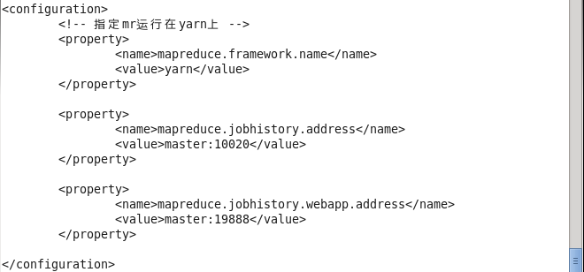
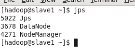

3台服务器准备好后，就可以配置hadoop集群了。配置集群需要 putty、jdk、hadoop安装包，自行下载最新版本即可。可参考[集群准备](/大数据生态圈/Hadoop/入门/集群准备.md)

1.本地安装putty工具，主要使用pscp.exe，需要下载。

2.将jdk、hadoop同步到slave1，window+r，输入cmd。进入putty安装目录。

pscp jdk本地存放文件的绝对路径 root@192.168.188.201:/usr/local

pscp hadoop本地存放文件的绝对路径 root@192.168.188.201:/usr/local

3.解压安装jdk、hadoop ：tar -xzvf jdk.*.tar.gz;tar -xzvf hadoop.*.tar.gz

4.创建hadoop用户，并设置密码；adduser hadoop ；passwd hadoop

5.将hadoop目录整个添加到hadoop用户下：chown -R hadoop.hadoop hadoop安装目录

6.切换到hadoop用户下，并配置环境变量

su hadoop

vim ~/.bash_profile，在最后添加，如下：

7.配置hadoop相关环境

进入环境目录：cd /usr/local/hadoop-2.7.3/etc/hadoop

修改 hadoop-env.sh yarn-env.sh 两个环境的 JAVA_HOME

vim yarn-env.sh 修改为JAVA_HOME=/usr/local/jdk1.8.0_131

vim yarn-env.sh 修改为JAVA_HOME=/usr/local/jdk1.8.0_131

vim core-site.xml

vim hdfs-site.xml

vim mapred-site.xml

vim slaves

slave2

slave3

vim yarn-site.xml

配置好hadoop以后，将jdk、hadoop目录及环境变量文件.bash_profile同步到其他2台服务器上相同目录上：

scp .bash_profile slave2:/home/hadoop/

scp .bash_profile slave3:/home/hadoop/

scp -r jdk1.8.0_131 slave2:/usr/local/

scp -r jdk1.8.0_131 slave3:/usr/local/

scp -r hadoop-2.7.3 slave2:/usr/local/

scp -r hadoop-2.7.3 slave3:/usr/local/

下面启动hadoop

1、格式化namenode（是对namenode进行初始化）

hdfs namenode -format

2、执行命令start-all.sh

3、查看启动的情况：3台服务器分别执行命令:jps

master的服务

slave的服务

证明hadoop启动成功了

下面运行下自带的wordcount程序，看看部署的成果

创建输入目录 hadoop fs -mkdir /input

将本地文件传到input hadoop fs -put file* /input

如果程序输出目录存在需要先删除 hadoop fs -rm -r /output

运行自带的例子 hadoop jar share/hadoop/mapreduce/hadoop-mapreduce-examples-2.7.3.jar wordcount /input /output

查看结果 hadoop fs -cat /output/

运行期间碰上两个问题：

一个是yarn内存不够用，按下图修改yarn内存 

vim yarn-site.xml 按下图修改yarn.scheduler.minimum-allocation-mb的值

另一个是连接不上服务器，因为没有启动 jobHistoryServer 服务

sbin/mr-jobhistory-daemon.sh start historyserver

启动即可

**番外**

VMvare虚拟机有个功能挺好，可以克隆安装好的虚拟机服务器。

1. 选择想要克隆的服务器，右键:管理-克隆，点击下一步

2. 选择 虚拟机中当前状态(C)，点击下一步

3. 选择 创建完整克隆(F)，点击下一步

4. 修改 虚拟机名称(V) 和 位置(L)，完成。

等待克隆完成。

**克隆虚拟机可以节省很多操作**

可以把网络配置完后克隆2台。

此时需要给克隆完的服务器重新配置一个ip
在root帐户下进行操作：

rm -f /etc/udev/rules.d/70-persistent-net.rules

查看mac

ifconfig

修改mac地址和对应的ip 

vim /etc/sysconfig/network-scripts/ifcfg-eth0

修改主机名

vim /etc/sysconfig/network

reboot重启服务器。

然后配置免密、hadoop

也可以再进一步把haoop环境配置完，再克隆2台，然后配置ip，免密。

感兴趣的可以练练。
